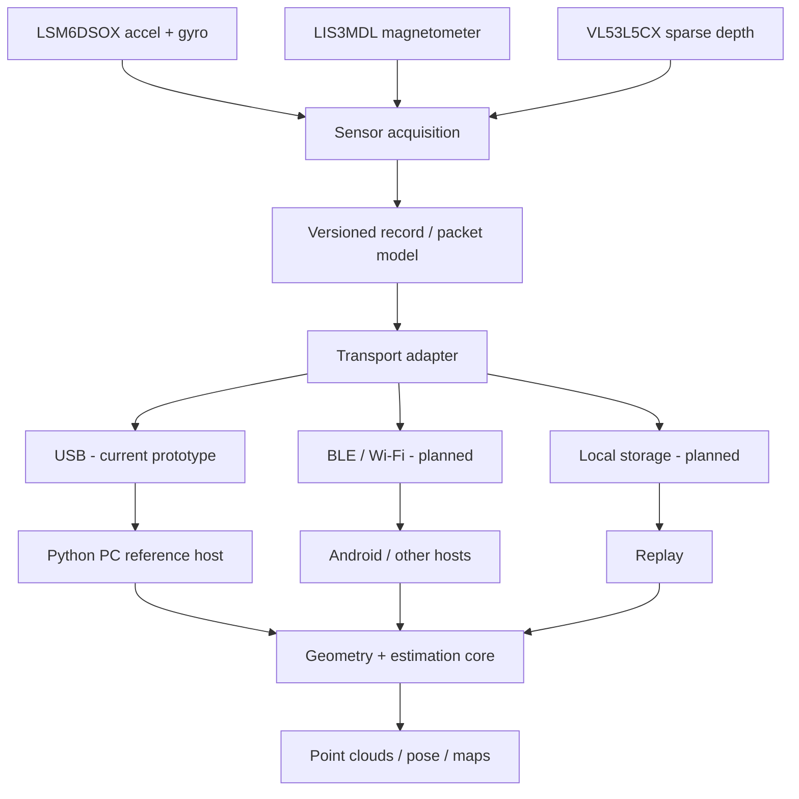

# Rangeweave - RGB-Free Active Depth + IMU Spatial Mapping

> **Project status: sensor acquisition baseline validated; protocol/acquisition software is now in development; tracking and 3D reconstruction are work in progress.**

This project explores a small, inexpensive, **RGB-free** sensing module that combines sparse time-of-flight depth with inertial sensing. The goal is to turn synchronized depth + motion observations into trajectories, sparse point clouds and eventually 3D maps of objects and environments, while keeping the sensing head compact enough to migrate beyond the current Raspberry Pi Pico prototype.

The project is deliberately being built in layers. The current reference hardware has demonstrated reliable, timestamped coexistence of an 8x8 VL53L5CX depth sensor, LSM6DSOX accelerometer/gyroscope and LIS3MDL magnetometer. It has **not yet demonstrated robust freehand SLAM or accurate 3D reconstruction**.

## Why this project exists

Many useful spatial applications do not inherently require an RGB camera. A sparse active-depth + IMU module could be useful for experimentation in handheld scanning, robotics, XR tracking, accessibility, geometry capture and other applications where size, cost or image privacy matter.

“RGB-free” is a capability statement, not a blanket privacy guarantee: depth and motion data can still reveal information about people or spaces depending on how a system is deployed.

## Current validated reference build

- **MCU:** Raspberry Pi Pico 2 W (RP2350), MicroPython.
- **IMU bus:** hardware I2C0, GP4 SDA / GP5 SCL, 400 kHz.
- **Depth bus:** hardware I2C1, GP2 SDA / GP3 SCL, 1 MHz.
- **Motion sensors:** LSM6DSOX at `0x6A`, LIS3MDL at deterministic `0x1E` (`ADM -> 3V3`).
- **Depth sensor:** VL53L5CX at `0x29`, 8x8 / 64 zones at approximately 15 fps.
- **Timing:** LSM6DSOX hardware FIFO + one hardware timestamp record per inertial slot.
- **Per-unit timing:** `INTERNAL_FREQ_FINE` discovery plus a rolling Pico <-> LSM clock model; downstream code must not assume a fixed real IMU sample rate.

The reference v0.5 diagnostic run reached `SYSTEM READY: PASS` with aligned accel/gyro/timestamp records, 100% magnetometer acquisition during the startup window, approximately 15 fps depth acquisition, and no reported FIFO or sensor I/O errors. See [the validation record](docs/validation/reference-unit-v0.5.md).

## Architecture

The **packet/record model is intended to be the portability boundary**. USB and Pico-specific details must not leak into the meaning of sensor records. That lets us prototype over Pico USB now while keeping an ESP32-class controller, Android host, BLE/Wi-Fi transport and standalone logging viable later.

## Quick start: reproduce the sensor stack

1. Read the [build guide](docs/build-guide.md).
2. Assemble the reference hardware using [the Pico 2 W wiring sheet](hardware/wiring/pico2w-reference.md).
3. Install the validated class of Pimoroni RP2350/Pico 2 W MicroPython build described in the guide. The UF2 is **not vendored here**.
4. Obtain the VL53L5CX firmware blob as described in the guide or use [`tools/fetch_vl53l5cx_firmware.py`](tools/fetch_vl53l5cx_firmware.py). The blob is **not vendored here**.
5. Bring up the system in order:
   - [`i2c_scan.py`](firmware/pico2w/diagnostics/i2c_scan.py)
   - [`imu_bringup.py`](firmware/pico2w/diagnostics/imu_bringup.py)
   - [`tof_bringup.py`](firmware/pico2w/diagnostics/tof_bringup.py)
   - [`reproducible_sensor_stack.py`](firmware/pico2w/diagnostics/reproducible_sensor_stack.py)
6. Do not proceed to motion datasets until the full diagnostic reports `SYSTEM READY: PASS`.

A second healthy physical IMU **does not need to reproduce the reference unit's ~101.06 Hz measured rate**. The firmware explicitly discovers and measures each unit's time base.

## What works now

**VALIDATED on the current reference unit**

- Split-bus sparse depth + inertial acquisition.
- LSM6DSOX FIFO protection during long VL53L5CX frame transfers.
- Hardware FIFO timestamp parsing and slot-integrity checks.
- Per-device oscillator/timestamp characterization.
- Pico <-> LSM clock correlation.
- Deterministic LIS3MDL addressing and reliable magnetometer acquisition under the tested workload.
- Reproducibility self-test for newly assembled reference stacks.

**EXPERIMENTAL / implementation candidate**

- Rangeweave wire protocol v0.1: COBS framing, CRC16, global packet sequence and initial `IMU_BATCH`, `MAG`, `TOF_GRID`, `CLOCK_SYNC` and `STATUS` records.
- Standard-library Python protocol decoder/stream parser.
- Shared byte-level golden fixtures and corruption/resynchronisation tests.

**NEXT**

- Define the deferred stream/config metadata record for protocol v0.1.
- Implement Pico acquisition firmware separate from diagnostic firmware.
- Implement Python USB capture + lossless recording + replay.
- Implement a Kotlin/Android parser using the same golden packet fixtures.
- Run an ESP32-class portability spike before the host architecture becomes Pico-specific.
- Build the first calibrated 64-point depth projection and live sparse point-cloud viewer.

**NOT YET CLAIMED**

- Reliable freehand 6DoF tracking.
- Loop closure.
- Dense or metrically accurate object/room reconstruction.
- Android, BLE/Wi-Fi or ESP32 implementations.
- Guaranteed reproducibility across arbitrary third-party assemblies.

## Repository map

- [`docs/`](docs/) - build guide, roadmap, architecture, ADRs, calibration/porting notes and validation evidence.
- [`firmware/pico2w/diagnostics/`](firmware/pico2w/diagnostics/) - curated builder-facing hardware diagnostics.
- [`firmware/pico2w/acquisition/`](firmware/pico2w/acquisition/) - next sensor-stream firmware stage.
- [`firmware/esp32/`](firmware/esp32/) - planned portability work.
- [`protocol/`](protocol/) - language-neutral wire specification and golden vectors.
- [`host/python/`](host/python/) - Python reference protocol implementation and future capture/replay/geometry stack.
- [`android/`](android/) - Android portability notes and future implementation.
- [`hardware/`](hardware/) - BOM, wiring and mechanical/PCB notes.
- [`datasets/`](datasets/) - policy and, later, small intentionally published golden recordings.
- [`sim/`](sim/) - future simulation / ML data-generation work.

For the complete intended layout, see [Repository layout](docs/repository-layout.md).

## Engineering rules

1. Preserve raw measurements and explicit timestamps.
2. Never infer time from sample index or nominal ODR.
3. Keep sensor semantics independent of USB, MicroPython and Pico GPIOs.
4. Make live and replayed data enter the same host APIs.
5. Define coordinate frames, units and byte order explicitly.
6. Keep uncertainty rather than forcing a confident pose when motion is poorly observable.
7. Use conventional physics/geometry baselines before learned corrections.
8. Mark capabilities **VALIDATED**, **EXPERIMENTAL** or **PLANNED**.
9. Keep Android and small-MCU portability notes alongside new features, not as a cleanup task years later.

See the [project plan](docs/project-plan.md) and [architecture decision records](docs/adr/README.md).

## Contributing

Contributions are welcome. Please start with [CONTRIBUTING.md](CONTRIBUTING.md). Hardware bug reports are most useful when they include the bus scan, sensor IDs, complete reproducibility self-test, MicroPython runtime string and a clear wiring photo.

The early experimental scripts that led to the final bus/FIFO/timestamp architecture are intentionally **not** part of the normal source tree. Their conclusions are summarized in [development history](docs/development-history.md); Git history should carry future iterations from this point onward.

## License

See [LICENSE](LICENSE). No third-party firmware binaries are included in this repository; see [THIRD_PARTY_NOTICES.md](THIRD_PARTY_NOTICES.md).
